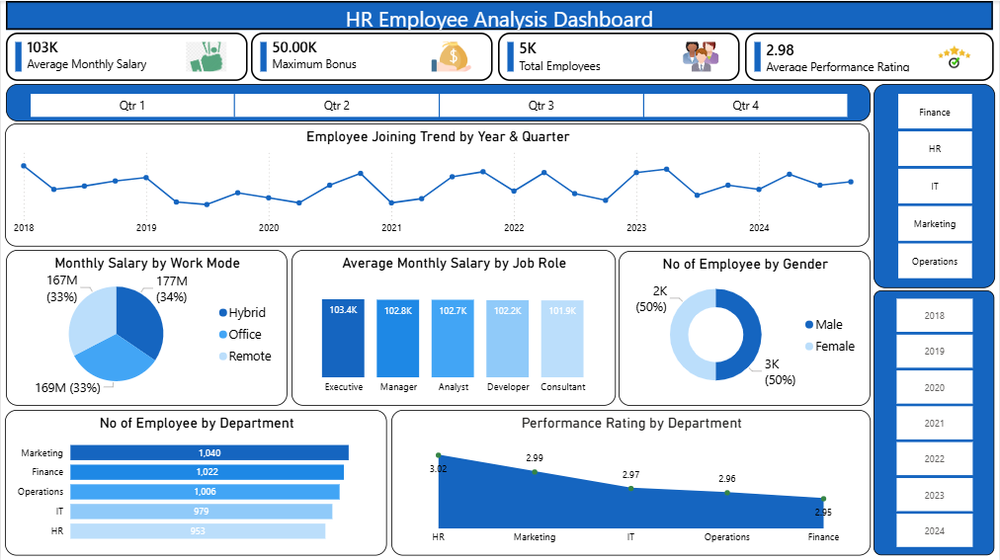

# HR Employee Analysis

## Project Overview
The HR employee analysis is an interactive Power BI project designed to analyze workforce data and provide insights into employee demographics, salaries, performance, and departmental trends.
 
The dashboard enables HR teams and management to monitor key workforce metrics and support data-driven decision-making.

## Objective
The objective of this project is to analyze employee data and build an interactive dashboard that helps answer important HR business questions related to workforce distribution, employee performance, compensation, and work patterns.

## Tools Used
- Power BI

## Project Structure

```
hr_employee_analysis/
├── dataset/
│   └── hr_employee_analysis_dataset.xlsx  
├── dashboard/
│   └── hr_employee_analysis_dashboard.pbix
├── screenshots/
│   └── dashboard_preview.png
└── README.md
```

## Dataset Information

Dataset Size: 5,000 records | 15 columns

### Features
- Employee_ID
- Joining_Date
- Department 
- Job_Role
- Gender
- Age
- Monthly_Salary
- Performance_Rating 
- Training_Hours
- Attrition
- Work_Mode
- City
- Experience_Years
- Leave_Balance
- Bonus

**Note:** This dataset is synthetic and generated for practice purposes. While it contains no missing values or duplicates, a small percentage of records show minor logical inconsistencies (e.g., experience years slightly exceeding what age would realistically allow) — a known limitation of synthetically generated data rather than a real-world data collection issue.

## Dashboard Preview



## KPI Cards
- Average Monthly Salary
- Maximum Bonus
- Total Employees
- Average Performance Rating

## Dashboard Visualizations
- Employee Joining Trend by Year & Quarter
- Monthly Salary Distribution by Work Mode
- Average Monthly Salary by Job Role
- Employee Distribution by Gender
- Employee Count by Department
- Performance Rating by Department

## Interactive Filters
- Department
- Joining Month

## Key Insights
- Tracked monthly employee joining trends across the organization.
- Compared average salaries across different job roles.
- Analyzed employee distribution by department and gender.
- Evaluated department-wise performance ratings.
- Compared salary distribution based on work mode (Office, Hybrid, Remote).
- Provided interactive filtering for better workforce analysis.

## How to Reproduce
1. Clone this repository
2. Open dashboard/hr_employee_analysis_dashboard.pbix in Power BI Desktop

## Skills Demonstrated
- Dashboard Design
- Data Visualization
- KPI Development
- HR Data Analysis
- Interactive Report Building
- Business Insights Generation
- Data Storytelling

## Author

Sushil Kumar | Aspiring Data Analyst | Skills: SQL, Power BI, Python, Excel

Note: This particular project focuses on Power BI dashboard design; dataset was sourced pre-cleaned.